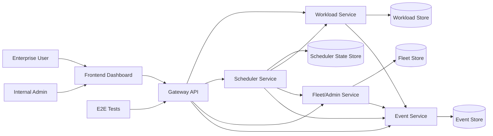

# Master RFC Plan

## Goal

Build a small GPU workload control plane that is runnable locally, deployable cheaply, and easy to evaluate through clear scheduling behavior, operational state, and disruption recovery.

## Architecture Assumption

- Single repo.
- Go backend owns gateway, domain model, scheduler, APIs, events, and state.
- React/Vite/TypeScript frontend only for reviewer-facing clarity.
- Start with in-memory state for walking skeleton; move to Postgres for durable integration/E2E if needed.
- Docker Compose for local development.
- Render as primary deployment target; Railway/Fly only as fallback.
- Explicit scheduler ticks instead of background timers for deterministic tests.

## High-Level Design

For v1, these services can be implemented as modules inside one Go process with one in-memory or Postgres-backed store. The boundaries are still useful because they preserve a clean path to split services and databases later.

## Core Data Flows

### Workload Submission

1. Enterprise user submits workload from UI.
2. Gateway API validates request shape and forwards to Workload Service.
3. Workload Service stores workload as `pending`.
4. Scheduler Service evaluates fleet capacity and policy.
5. Workload becomes `running` with placement or stays `pending` with queue reason.
6. Event Service records the decision.
7. UI reads workload state, fleet state, utilization, and events through Gateway API.

### Admin Disruption

1. Admin triggers node failure, spot preemption, or recovery.
2. Gateway API forwards command to Fleet/Admin Service.
3. Fleet/Admin Service updates fleet state.
4. Scheduler Service reevaluates affected and pending workloads.
5. Workloads move to `running`, `pending`, `preempted`, or `failed`.
6. Event Service records disruption and scheduler decisions.
7. Admin dashboard shows before/after state.

### Verification

1. E2E test targets `BASE_URL`.
2. Test submits workload, observes placement or queueing, triggers disruption, and verifies events/utilization.
3. Same flow runs against local Docker and deployed Render URL.

## Milestones

### 1. Walking Skeleton

- Backend health endpoint.
- Seeded fleet API.
- Docker Compose local run.
- Unit test command.

Acceptance: fresh checkout can start the app and read seeded fleet state.

### 2. Scheduler Core

- Workload and node models.
- Deterministic placement by GPU type/count, priority, workload type, and spot tolerance.
- Queueing with explicit reasons.
- Scheduler unit tests.

Acceptance: scheduler explains placed and queued decisions.

### 3. Workload And Admin APIs

- Submit/list/read workloads.
- Fleet summary and utilization.
- Recent events.
- Scheduler tick endpoint.

Acceptance: APIs support frontend and integration tests.

### 4. Disruptions

- Node failure.
- Spot preemption.
- Node recovery.
- Reschedule or queue affected workloads.

Acceptance: disruption behavior is visible and tested.

### 5. Minimal Frontend

- Submission surface.
- Admin dashboard.
- Fleet, utilization, workloads, events, and disruption controls.

Acceptance: reviewer can run the core demo without reading logs.

### 6. Deploy And E2E

- Render deployment.
- Same E2E suite runs against local and deployed `BASE_URL`.
- README and `APPROACH.md` document setup, tradeoffs, and limits.

Acceptance: `BASE_URL=<local-or-deployed> make e2e` validates the core flow.

## Workstream Contracts

- Frontend owns UI state, forms, dashboards, and display of backend explanations.
- Backend owns scheduling policy, state transitions, events, and API contracts.
- Infra owns local runtime, deploy config, env docs, and test command wiring.

## Test Strategy

- Unit tests first for scheduler and frontend components.
- Integration tests next for API plus real app state.
- E2E tests last against local and deployed URLs.
- Every milestone must leave a working app with passing verification.

## Open Questions

- Should high-priority workloads preempt lower-priority running workloads, or only reorder pending work?
- Is in-memory state sufficient for the deployed demo, or do we need SQLite?
- Should the first frontend be one dashboard page before adding routes?
